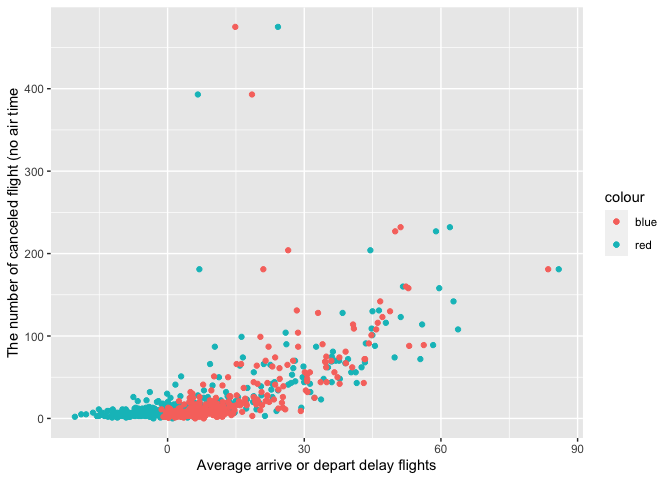

README
================
Jack Chen
9/24/2022

``` r
library(dplyr)
```

    ## Warning: package 'dplyr' was built under R version 4.1.2

    ## 
    ## Attaching package: 'dplyr'

    ## The following objects are masked from 'package:stats':
    ## 
    ##     filter, lag

    ## The following objects are masked from 'package:base':
    ## 
    ##     intersect, setdiff, setequal, union

``` r
library(nycflights13)
library(ggplot2)
summary(flights)
```

    ##       year          month             day           dep_time    sched_dep_time
    ##  Min.   :2013   Min.   : 1.000   Min.   : 1.00   Min.   :   1   Min.   : 106  
    ##  1st Qu.:2013   1st Qu.: 4.000   1st Qu.: 8.00   1st Qu.: 907   1st Qu.: 906  
    ##  Median :2013   Median : 7.000   Median :16.00   Median :1401   Median :1359  
    ##  Mean   :2013   Mean   : 6.549   Mean   :15.71   Mean   :1349   Mean   :1344  
    ##  3rd Qu.:2013   3rd Qu.:10.000   3rd Qu.:23.00   3rd Qu.:1744   3rd Qu.:1729  
    ##  Max.   :2013   Max.   :12.000   Max.   :31.00   Max.   :2400   Max.   :2359  
    ##                                                  NA's   :8255                 
    ##    dep_delay          arr_time    sched_arr_time   arr_delay       
    ##  Min.   : -43.00   Min.   :   1   Min.   :   1   Min.   : -86.000  
    ##  1st Qu.:  -5.00   1st Qu.:1104   1st Qu.:1124   1st Qu.: -17.000  
    ##  Median :  -2.00   Median :1535   Median :1556   Median :  -5.000  
    ##  Mean   :  12.64   Mean   :1502   Mean   :1536   Mean   :   6.895  
    ##  3rd Qu.:  11.00   3rd Qu.:1940   3rd Qu.:1945   3rd Qu.:  14.000  
    ##  Max.   :1301.00   Max.   :2400   Max.   :2359   Max.   :1272.000  
    ##  NA's   :8255      NA's   :8713                  NA's   :9430      
    ##    carrier              flight       tailnum             origin         
    ##  Length:336776      Min.   :   1   Length:336776      Length:336776     
    ##  Class :character   1st Qu.: 553   Class :character   Class :character  
    ##  Mode  :character   Median :1496   Mode  :character   Mode  :character  
    ##                     Mean   :1972                                        
    ##                     3rd Qu.:3465                                        
    ##                     Max.   :8500                                        
    ##                                                                         
    ##      dest              air_time        distance         hour      
    ##  Length:336776      Min.   : 20.0   Min.   :  17   Min.   : 1.00  
    ##  Class :character   1st Qu.: 82.0   1st Qu.: 502   1st Qu.: 9.00  
    ##  Mode  :character   Median :129.0   Median : 872   Median :13.00  
    ##                     Mean   :150.7   Mean   :1040   Mean   :13.18  
    ##                     3rd Qu.:192.0   3rd Qu.:1389   3rd Qu.:17.00  
    ##                     Max.   :695.0   Max.   :4983   Max.   :23.00  
    ##                     NA's   :9430                                  
    ##      minute        time_hour                  
    ##  Min.   : 0.00   Min.   :2013-01-01 05:00:00  
    ##  1st Qu.: 8.00   1st Qu.:2013-04-04 13:00:00  
    ##  Median :29.00   Median :2013-07-03 10:00:00  
    ##  Mean   :26.23   Mean   :2013-07-03 05:22:54  
    ##  3rd Qu.:44.00   3rd Qu.:2013-10-01 07:00:00  
    ##  Max.   :59.00   Max.   :2013-12-31 23:00:00  
    ## 

How many flights have a missing dep_time? What other variables are
missing? What might these rows represent?

``` r
filter(flights,is.na(dep_time))
```

    ## # A tibble: 8,255 × 19
    ##     year month   day dep_time sched_dep_time dep_delay arr_time sched_arr_time
    ##    <int> <int> <int>    <int>          <int>     <dbl>    <int>          <int>
    ##  1  2013     1     1       NA           1630        NA       NA           1815
    ##  2  2013     1     1       NA           1935        NA       NA           2240
    ##  3  2013     1     1       NA           1500        NA       NA           1825
    ##  4  2013     1     1       NA            600        NA       NA            901
    ##  5  2013     1     2       NA           1540        NA       NA           1747
    ##  6  2013     1     2       NA           1620        NA       NA           1746
    ##  7  2013     1     2       NA           1355        NA       NA           1459
    ##  8  2013     1     2       NA           1420        NA       NA           1644
    ##  9  2013     1     2       NA           1321        NA       NA           1536
    ## 10  2013     1     2       NA           1545        NA       NA           1910
    ## # … with 8,245 more rows, and 11 more variables: arr_delay <dbl>,
    ## #   carrier <chr>, flight <int>, tailnum <chr>, origin <chr>, dest <chr>,
    ## #   air_time <dbl>, distance <dbl>, hour <dbl>, minute <dbl>, time_hour <dttm>

# They are 8255 missing dep_time in the flight data frame. In the meantime, the dep_delay, arr_time, arr_delay, and air_time are also missing. These rows are missing because they never depart, so they will not be a departure delay time, arrive delay time, and have no air flight time.

currently dep_time and sched_dep_time are convenient to look at, but
hard to compute with because they’re not really continuous numbers.
Convert them to a more convenient representation of number of minutes
since midnight.

``` r
flights<- mutate(flights,
  dep_time = (dep_time %/% 100 * 60 + dep_time %% 100) %% (24*60),
  sched_dep_time = (sched_dep_time %/% 100 * 60 + sched_dep_time %% 100) %% (24*60)
)
summary(flights)
```

    ##       year          month             day           dep_time    sched_dep_time
    ##  Min.   :2013   Min.   : 1.000   Min.   : 1.00   Min.   :   0   Min.   :  66  
    ##  1st Qu.:2013   1st Qu.: 4.000   1st Qu.: 8.00   1st Qu.: 547   1st Qu.: 546  
    ##  Median :2013   Median : 7.000   Median :16.00   Median : 841   Median : 839  
    ##  Mean   :2013   Mean   : 6.549   Mean   :15.71   Mean   : 822   Mean   : 817  
    ##  3rd Qu.:2013   3rd Qu.:10.000   3rd Qu.:23.00   3rd Qu.:1064   3rd Qu.:1049  
    ##  Max.   :2013   Max.   :12.000   Max.   :31.00   Max.   :1439   Max.   :1439  
    ##                                                  NA's   :8255                 
    ##    dep_delay          arr_time    sched_arr_time   arr_delay       
    ##  Min.   : -43.00   Min.   :   1   Min.   :   1   Min.   : -86.000  
    ##  1st Qu.:  -5.00   1st Qu.:1104   1st Qu.:1124   1st Qu.: -17.000  
    ##  Median :  -2.00   Median :1535   Median :1556   Median :  -5.000  
    ##  Mean   :  12.64   Mean   :1502   Mean   :1536   Mean   :   6.895  
    ##  3rd Qu.:  11.00   3rd Qu.:1940   3rd Qu.:1945   3rd Qu.:  14.000  
    ##  Max.   :1301.00   Max.   :2400   Max.   :2359   Max.   :1272.000  
    ##  NA's   :8255      NA's   :8713                  NA's   :9430      
    ##    carrier              flight       tailnum             origin         
    ##  Length:336776      Min.   :   1   Length:336776      Length:336776     
    ##  Class :character   1st Qu.: 553   Class :character   Class :character  
    ##  Mode  :character   Median :1496   Mode  :character   Mode  :character  
    ##                     Mean   :1972                                        
    ##                     3rd Qu.:3465                                        
    ##                     Max.   :8500                                        
    ##                                                                         
    ##      dest              air_time        distance         hour      
    ##  Length:336776      Min.   : 20.0   Min.   :  17   Min.   : 1.00  
    ##  Class :character   1st Qu.: 82.0   1st Qu.: 502   1st Qu.: 9.00  
    ##  Mode  :character   Median :129.0   Median : 872   Median :13.00  
    ##                     Mean   :150.7   Mean   :1040   Mean   :13.18  
    ##                     3rd Qu.:192.0   3rd Qu.:1389   3rd Qu.:17.00  
    ##                     Max.   :695.0   Max.   :4983   Max.   :23.00  
    ##                     NA's   :9430                                  
    ##      minute        time_hour                  
    ##  Min.   : 0.00   Min.   :2013-01-01 05:00:00  
    ##  1st Qu.: 8.00   1st Qu.:2013-04-04 13:00:00  
    ##  Median :29.00   Median :2013-07-03 10:00:00  
    ##  Mean   :26.23   Mean   :2013-07-03 05:22:54  
    ##  3rd Qu.:44.00   3rd Qu.:2013-10-01 07:00:00  
    ##  Max.   :59.00   Max.   :2013-12-31 23:00:00  
    ## 

# The trnasformation process is that the dep_time and sched_dep_time are convennient for people to look at for example 24:00 stands for midnight 12:00pm. 1305 stands for 13:05 minutes. The relationship between the first two digits are multiples of hundreds. You need to divide the hundreds and you will only get the hour range between 1 and 24. Next you need to multiple the hour by 60 because you want the format to be in minutes. The last two digits are the minutes. This %% will give you the remainder only. You sum the hour in minutes and the remainder you will have the total time. In addition, they are 1440 minutes in a day. So you treat 1440 as 0 for a new day.

Look at the number of canceled flights per day. Is there a pattern? Is
the proportion of canceled flights related to the average delay? Use
multiple dyplr operations, all on one line, concluding with
ggplot(aes(x= ,y=)) + geom_point()

``` r
flights %>%
  group_by(year,month,day) %>%
  summarise(canceled_per_day= sum(is.na(air_time)),
    mean_arr_delay = mean(arr_delay, na.rm = TRUE),
    mean_dep_delay = mean(dep_delay, na.rm = TRUE)) %>%
 ggplot(aes(y=canceled_per_day)) + 
 geom_point(aes(x=mean_arr_delay,colour = "red")) + 
  geom_point(aes(x=mean_dep_delay,colour = "blue"))+
  labs(x = "Average arrive or depart delay flights", y = "The number of canceled flight (no air time")
```

    ## `summarise()` has grouped output by 'year', 'month'. You can override using the
    ## `.groups` argument.

<!-- -->

# Flight delays and cancellations appear to have a positive correlation. As the increase in average flight delays, the percentage of canceled flights also rises.
